# Allan fitment: a snugger desk-stand head

## What to print

There are two versions. Pick one, and keep the box you already have.

| Version | Print | Notes |
|---|---|---|
| **With collar** | [`amoled18_stand_head_allan_fitment_collar.stl`](amoled18_stand_head_allan_fitment_collar.stl) + [`amoled18_stand_collar_allan_fitment.stl`](amoled18_stand_collar_allan_fitment.stl) | The head is 3 mm taller and passes through a 3 mm ring. The lock blocks sit 3 mm under where the board's standoffs land. Print the collar in a different colour for each unit to tell them apart |
| **Without collar** | [`amoled18_stand_head_allan_fitment.stl`](amoled18_stand_head_allan_fitment.stl) | Same height as the stock head. The tower tops and lock blocks sit 0.5 mm under where the standoffs land, and the display screws clamp on 0.9 mm of plastic instead of 2 mm |

Both heads print back face down and the collar prints flat, all without supports. A collar
only fits the collar head, and the collar head needs a collar.

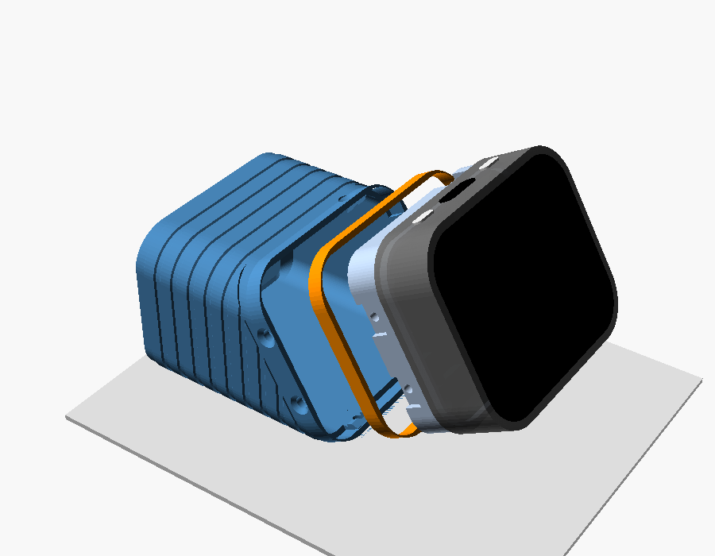

The box STLs are unchanged, and both heads fit all three:

| Battery | Box (unchanged, reprint not needed) |
|---|---|
| 103035 1000 mAh on edge | [`amoled18_stand_box_103035_edge.stl`](amoled18_stand_box_103035_edge.stl) |
| 802525 400 mAh flat | [`amoled18_stand_box_802525_flat.stl`](amoled18_stand_box_802525_flat.stl) |
| 104050 2400 mAh on end | [`amoled18_stand_box_104050_end.stl`](amoled18_stand_box_104050_end.stl) |

Both heads and the collar were checked against each of these three box STLs in their seated
positions. Nothing overlaps anywhere: each head's back rests on the box's ledge, as the
stock head's does, and the collar sits on the box's top band. The screws are unchanged too.

## 1. The problem

A head printed from the stock preset had two problems:

- **The front shell doesn't sit down on the box.** The black front shell should land on
  the box's 1.1 mm band, flush with the box's outside. It stops above it instead, and
  a white strip of the head shows between them.
- **The head is loose in the box.** It drops in but can move around.

| Side | USB-C edge | Corner |
|---|---|---|
| 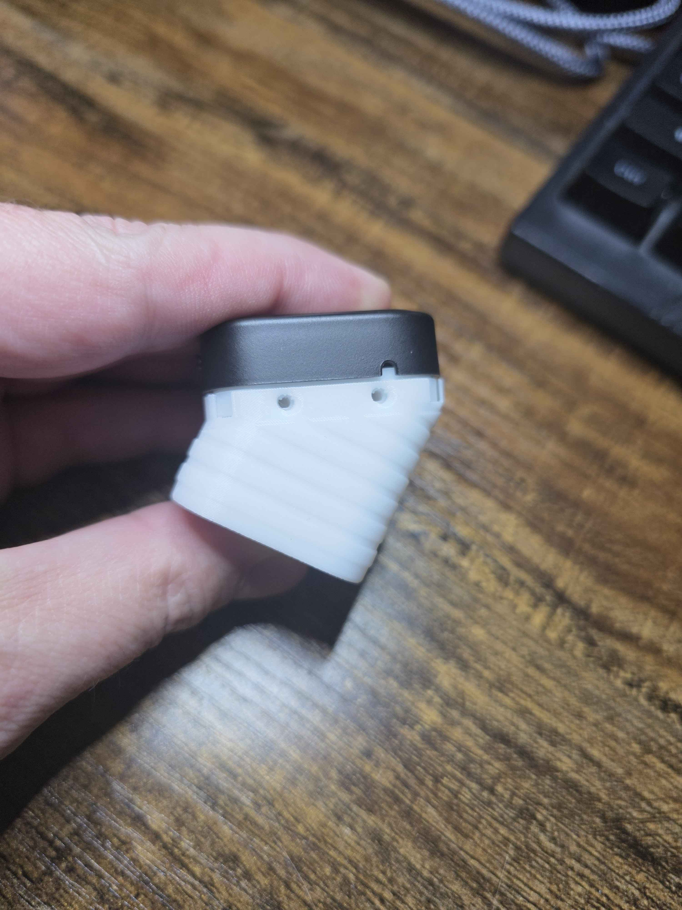 | 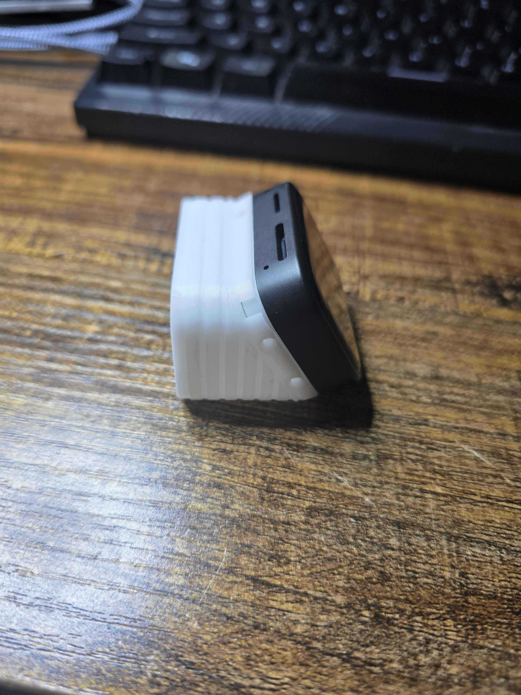 | 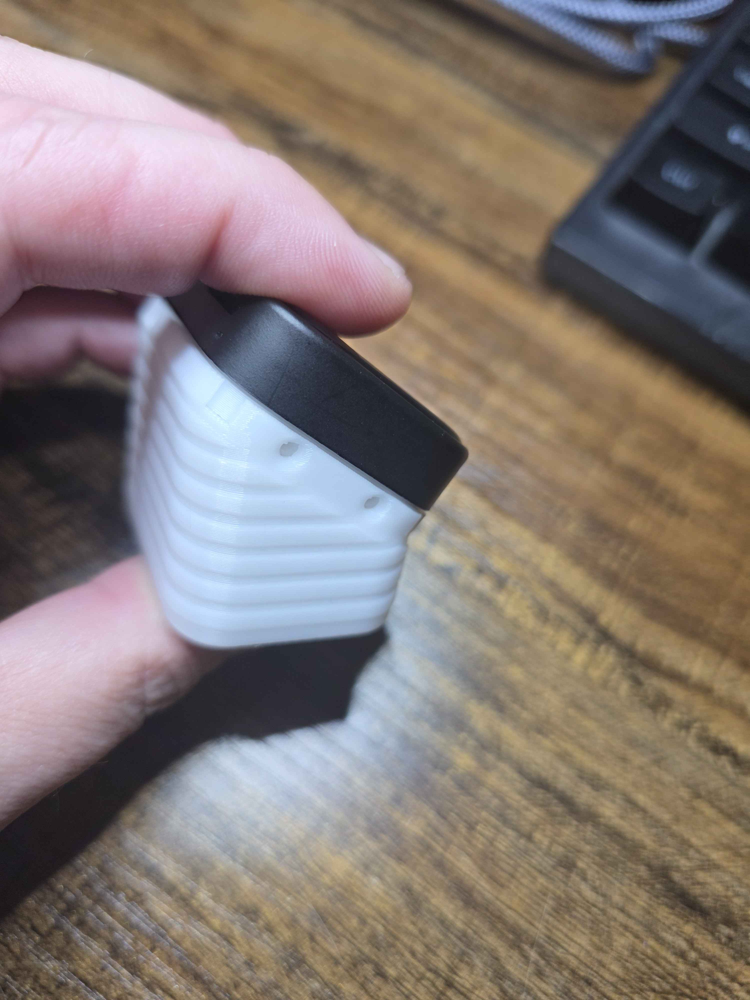 |

**Cutting off the rim didn't fix it.** Allan cut the rim off a stock head to test it, and
the shell still sat above the box. That points at the flat level the display's screws
mount to: the tops of the four screw towers, where the board's brass standoffs land.

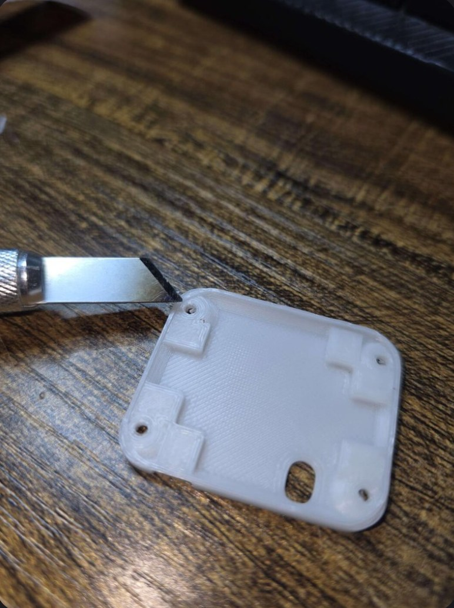

Each corner hole in that photo is a screw tower. The rectangles are the lock blocks that
the box's lock screws bite into.

## 2. Why it happened

The images below cut through one side wall of the stand, square to the head and between
the lock screws. Blue is the box, light blue is the head, dark gray is the front shell.

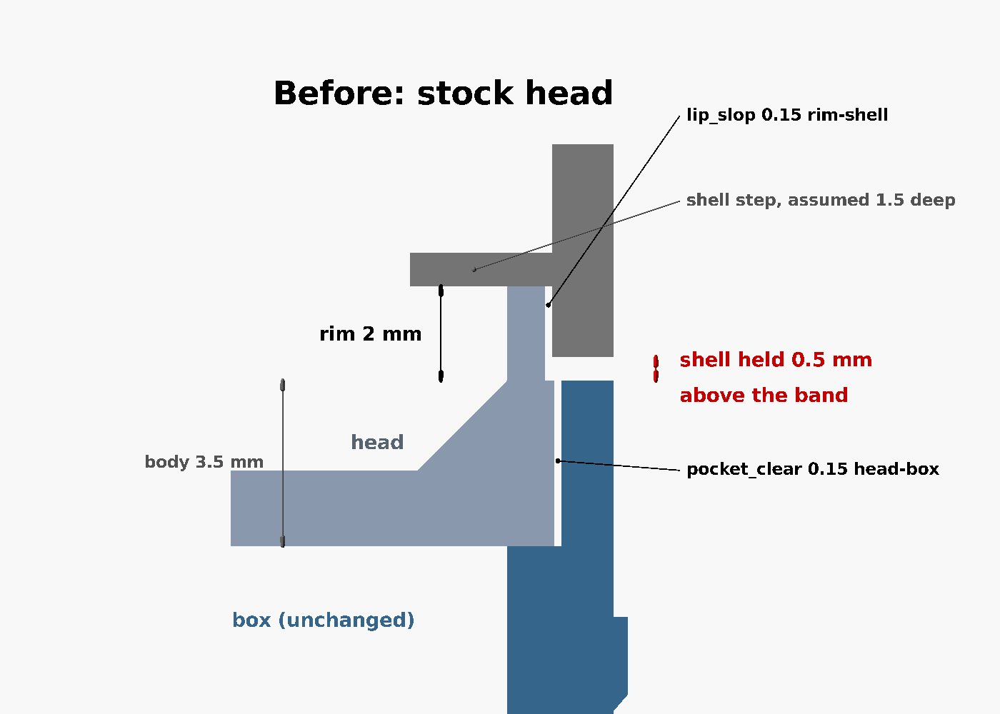

**The rim is too tall for the shell.** The head's rim goes up inside the front shell. The
shell has an inside step about 1.5 mm in from its edge. The stock rim is 2 mm tall, so it
hits that step while the shell's edge is still 0.5 mm above the box's band. The shell
can't come down any further, and the 0.5 mm of head below it is the white strip in the
photos.

Nobody has measured the step depth. The 1.5 mm in the drawing is an assumption
(`shell_depth` in the figure source). It matches the roughly 0.5 mm the shell sits too
high in the photos.

**The gaps are too wide for this print.** Up close, with the gaps drawn to scale:

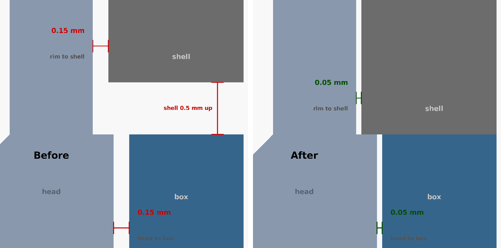

On the left (before), the head has 0.15 mm of gap to the box on every side, and the rim
has 0.15 mm to the shell. Those defaults are deliberately loose so a head fits from
most printers. On this print they left up to 0.3 mm of play across the head (0.15 mm on
each side), enough to feel. The red bar on the right is the
0.5 mm the shell is held up.

**The screw towers and lock blocks stop exactly at the seam.** The seam is the level
where the front shell's edge lands. The towers' flat tops are placed there because, on
the unit this was measured on, the board's brass standoffs end level with the shell's
edge. The six lock blocks reach under the board and stop at the same level. If a
unit's standoffs reach even a little past its shell's edge, they hit the tower tops
before the shell reaches the box, and the shell is held up. That happens whether or not
the rim is there.

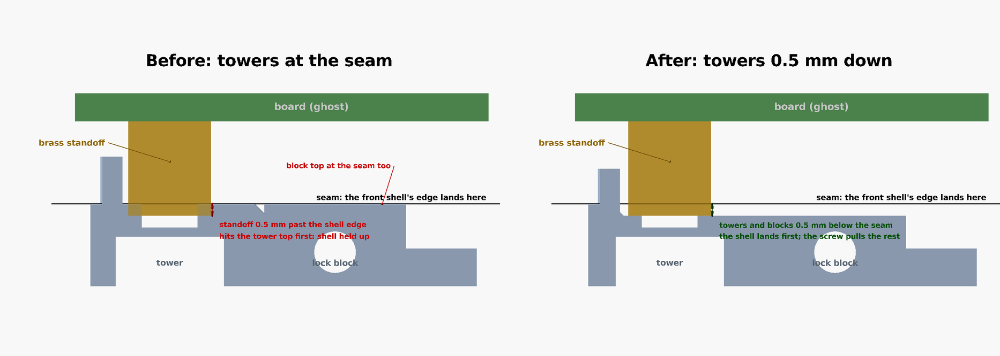

This cut goes through one tower and one lock block. The standoff in the drawing reaches
0.5 mm past the shell's edge, an assumed amount: nobody has measured how far past it the
standoffs on Allan's board reach. On the left (before), the standoff hits the
tower top, and the lock block's top is at the seam too. On the right (after), both are
0.5 mm lower, so the shell lands first and the screw pulls the board down onto the tower.

## 3. The fix

New preset **Desk stand: head, Allan fitment (snug)** in
[`amoled18_back_plate.json`](amoled18_back_plate.json). It starts from
**Desk stand: head (fits every box)** and changes these values:

| Parameter | Stock | Allan fitment | What it does |
|---|---|---|---|
| `lip_h` | 2.0 | 1.5 | Lowers the rim 0.5 mm, so it no longer holds the shell up. Lowered by 0.5 mm this pass, not a full 1 mm |
| `tower_drop` | 2.0 (= `lip_h`) | 2.0 (`lip_h` + 0.5) | Now 0.5 mm more than `lip_h`, so the tower tops stop 0.5 mm below the seam instead of at it. The standoffs can reach 0.5 mm past the shell's edge without holding the shell up |
| `stock_clear` | 3.9 | 3.4 | Keeps the head's body 3.5 mm tall, the depth of the box's pocket (see below) |
| `pocket_clear` | 0.15 | 0.05 | Head-to-box gap each side. Makes the head bigger; the box opening stays the same |
| `lip_slop` | 0.15 | 0.05 | Rim-to-shell gap each side |
| `lock_pad`, `stand_ledge` | 1.0 | 1.1 | Makes the head's lock-screw notches 0.1 mm deeper (see below) |
| `collar_h` | 0 | 0, or 3 with collar | Adds the collar and makes the head 3 mm taller (see section 5) |

`pocket_wall` stays at 1.1. Neither gap is 0.

There are also two changes to the model, [`amoled18_back_plate.scad`](amoled18_back_plate.scad).
Neither one changes the stock head or any other preset:

- **The lock blocks stop no higher than the tower tops.** They used to end at the seam,
  whatever the towers did. Now they drop with the towers, so nothing under the board
  stands higher than the towers do.
- **The 45° flare at the foot of each tower stops at the tower's top.** The flare is
  2 mm tall. With the towers lowered, it would have left a ring standing at the seam
  around each tower.

Without the collar, lowering the towers thins the plastic each display screw's head
clamps on to 0.9 mm. With the collar the towers are taller, so it's back to the full
2 mm. The console reports both numbers: `Towers: tops 0.5 mm below the seam ... screw seat
2 mm` and `Lock blocks: tops 3 mm below the seam`. Tighten the four display screws only
until they're snug. If a unit's
standoffs end level with the shell's edge, as on the measured unit, there's a 0.5 mm gap
under each one, and cranking the screws would pull the board toward the head.

### Why the notches get deeper

The box has a pad on its inside at each of the six lock screws, and the head has a notch
in its edge that the pad sits in. The notch depth is measured from the head's edge, so
when the head grew 0.1 mm each side, its notches moved out with it. The 103035 and 802525
boxes have 1.0 mm pads, and those pads would then press 0.05 mm into the head. Setting
`lock_pad` and `stand_ledge` to 1.1 makes each notch 0.1 mm deeper, which leaves 0.05 mm
clear around every pad. When you export the head, these two values only set the notch
depth. The boxes are not changed.

### Why `stock_clear` changes too

In desk-stand mode the model holds the head's total height at `stock_clear`, so the body
is `stock_clear - lip_h` tall. Lowering only the rim makes the body taller by the same
0.5 mm:

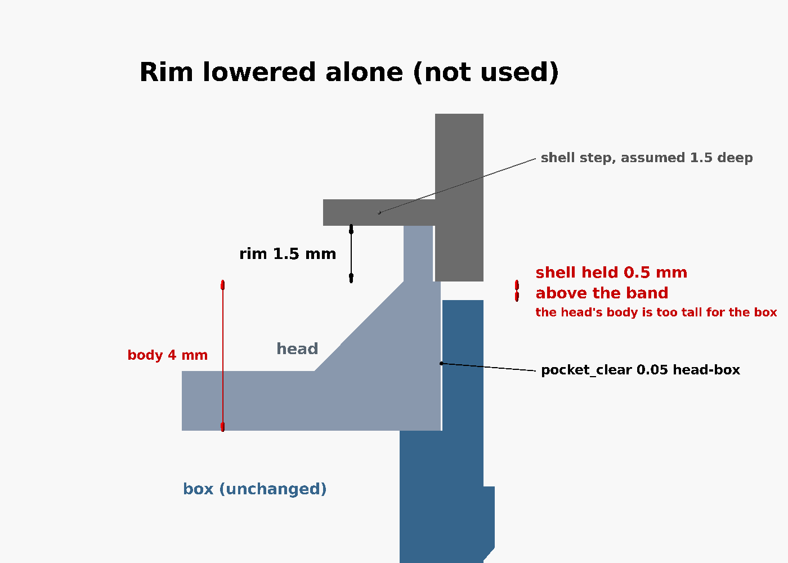

The rim is shorter, but the head now stands 0.5 mm out of the box, so the shell is held
up just as high as before, this time by the head's body. Lowering `stock_clear` by the
same 0.5 mm keeps the body at 3.5 mm, level with the band. The space for the board
inside the head is unchanged.

## 4. Why it's fixed

These cuts leave the collar out (it's covered in section 5). With it, the shell lands on
the collar instead of the band. Everything below works the same, 3 mm higher.

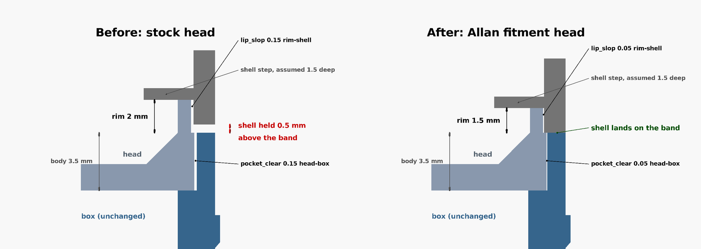

- **The shell lands on the band.** With a 1.5 mm rim, the shell's edge reaches the box's
  band before the rim reaches the step, so the shell sits flush with the box.
- **The head is level with the band.** The body is still 3.5 mm, so the head sits on the
  box's ledge exactly where the stock head did.
- **Nothing under the board reaches the seam.** The tower tops and lock blocks are
  0.5 mm below it, so the board's standoffs can't hold the shell up. Across the whole
  rim opening, the only thing higher is the stock 45° fillet where the floor meets the
  wall, right at the edge.
- **No more play.** The close-up above (right side) shows both gaps down to 0.05 mm. The
  head is 0.1 mm wider each side (35.3 × 42.9 mm instead of 35.1 × 42.7 mm), and so is the rim.

| | Stock head | Allan, without collar | Allan, with collar |
|---|---|---|---|
| Footprint | 35.1 × 42.7 mm | 35.3 × 42.9 mm | 35.3 × 42.9 mm |
| Part in the box | 3.5 mm | 3.5 mm | 3.5 mm |
| Collar | none | none | 3 mm ring |
| Head's overall height | 5.5 mm | 5.0 mm | 8.0 mm |
| Tower tops | at the seam | 0.5 mm below it | 0.5 mm below it |
| Lock blocks | at the seam | 0.5 mm below it | 3 mm below it |
| Screw seat in each tower | 1.4 mm | 0.9 mm | 2.0 mm |
| Rim | 2.0 mm | 1.5 mm | 1.5 mm |
| Gap to the box, each side | 0.15 mm | 0.05 mm | 0.05 mm |
| Gap to the shell, each side | 0.15 mm | 0.05 mm | 0.05 mm |

F5 in OpenSCAD prints `All checks passed.` for all three Allan presets. The new head hasn't been
printed yet.

## 5. The collar

Lowering the towers fixes the standoffs, but the six lock blocks still sat only 0.5 mm
under the board. The collar gives everything under the board more room without touching
the box:

- **The head is 3 mm taller.** Its lower 3.5 mm sits in the box exactly as before. The
  extra 3 mm passes up through the collar, and the rim and the screw towers sit on top of
  that.
- **The lock blocks stay down in the box.** They stop at the top of the box's band. With
  the collar, that is 3 mm below where the board's standoffs land, instead of at that level.
- **The collar is a plain ring** with the case's outline outside and the box's opening
  inside. It sits on the box's band, and the front shell sits on it, so the box, collar and
  shell are flush all round. It's held in place between them, with nothing to screw.

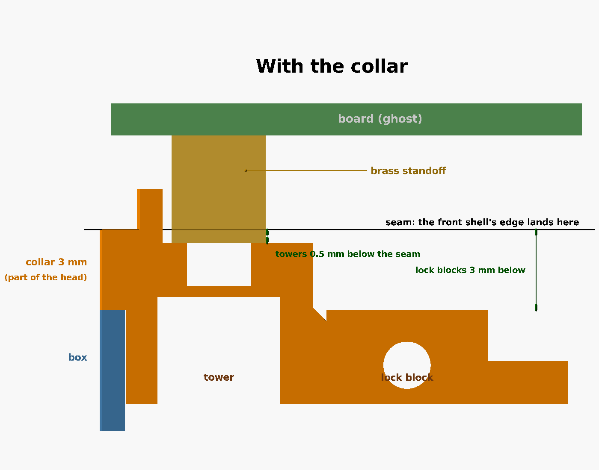

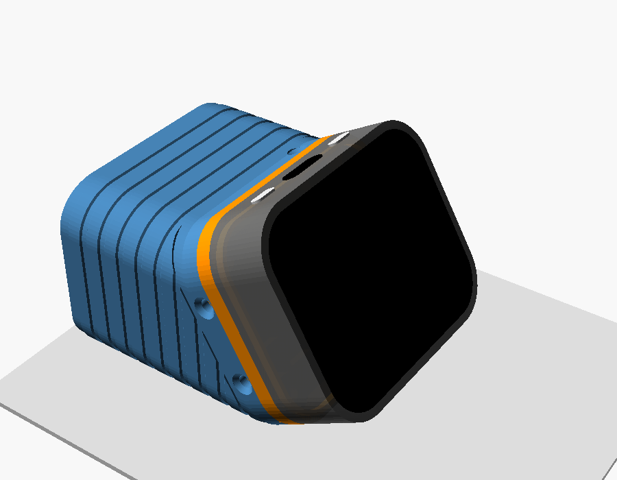

The collar's height is `collar_h` in the model (0 = no collar). Change it in **both**
presets, **Desk stand: head, Allan fitment with collar** and **Desk stand: collar, Allan
fitment**, and reprint both: the head grows by the same amount.
The box is the same at any collar height.

## Files

| File | What it is |
|---|---|
| [`amoled18_stand_head_allan_fitment.stl`](amoled18_stand_head_allan_fitment.stl) | The head without a collar (preset **Desk stand: head, Allan fitment (snug)**). It fits every stand box |
| [`amoled18_stand_head_allan_fitment_collar.stl`](amoled18_stand_head_allan_fitment_collar.stl) | The head for use with the collar (preset **Desk stand: head, Allan fitment with collar**). It fits every stand box |
| [`amoled18_stand_collar_allan_fitment.stl`](amoled18_stand_collar_allan_fitment.stl) | The collar, ready to print (preset **Desk stand: collar, Allan fitment**) |
| [`amoled18_back_plate.json`](amoled18_back_plate.json) | Preset **Desk stand: head, Allan fitment (snug)** |
| [`amoled18_back_plate.scad`](amoled18_back_plate.scad) | The model. New: `collar_h` and `part = collar`; the lock blocks and tower flares stop at the tower tops. Every other preset comes out the same |
| [`amoled18_stand_head.stl`](amoled18_stand_head.stl) | The original head, for comparison |
| [`renders/allan-fitment-before.png`](renders/allan-fitment-before.png), [`-trap.png`](renders/allan-fitment-trap.png), [`-after.png`](renders/allan-fitment-after.png), [`-compare.png`](renders/allan-fitment-compare.png) | The side-wall cuts |
| [`renders/allan-collar-exploded.png`](renders/allan-collar-exploded.png), [`-assembled.png`](renders/allan-collar-assembled.png), [`-cut.png`](renders/allan-collar-cut.png) | The collar |
| [`renders/allan-towers-compare.png`](renders/allan-towers-compare.png) ([before](renders/allan-towers-before.png), [after](renders/allan-towers-after.png)) | The cut through a tower and a lock block |
| [`photos/allan-fitment-rim-cut-off.jpg`](photos/allan-fitment-rim-cut-off.jpg) | Allan's test head with the rim cut off |
| [`renders/allan-fitment-gaps.png`](renders/allan-fitment-gaps.png) ([before](renders/allan-fitment-gaps-before.png), [after](renders/allan-fitment-gaps-after.png)) | The close-ups of the gaps |
| [`renders/src/fig_allan_fitment.scad`](renders/src/fig_allan_fitment.scad), [`fig_allan_towers.scad`](renders/src/fig_allan_towers.scad), [`fig_allan_box_slice.scad`](renders/src/fig_allan_box_slice.scad) | The sources for those images. [`renders/make_renders.sh`](renders/make_renders.sh) regenerates them |

## Re-exporting the head

In OpenSCAD's Customizer pick the preset, set `smoothness` to 96, then F6 and export.
Or from the command line:

```
openscad -o amoled18_stand_head_allan_fitment.stl -p amoled18_back_plate.json \
  -P "Desk stand: head, Allan fitment (snug)" -D smoothness=96 amoled18_back_plate.scad
openscad -o amoled18_stand_head_allan_fitment_collar.stl -p amoled18_back_plate.json \
  -P "Desk stand: head, Allan fitment with collar" -D smoothness=96 amoled18_back_plate.scad
openscad -o amoled18_stand_collar_allan_fitment.stl -p amoled18_back_plate.json \
  -P "Desk stand: collar, Allan fitment" -D smoothness=96 amoled18_back_plate.scad
```

Don't scale the old STL instead. Scaling stretches the screw holes and towers too.

## If it still doesn't fit

0.05 mm gaps are tight, so:

- **Head won't go into the box:** raise `pocket_clear` to 0.1.
- **Shell won't press onto the rim:** raise `lip_slop` to 0.1.
- **Shell still sits above the box face with the head screwed to the display:** measure
  how far the board's standoffs reach past the shell's edge, and raise `tower_drop` by
  that much more. The lock blocks follow the towers down.
- **Shell still sits above the box face with the rim touching the shell's inside:** lower
  `lip_h` and `stock_clear` by the same amount, and lower `tower_drop` by that amount too.

Don't set either gap to 0.
