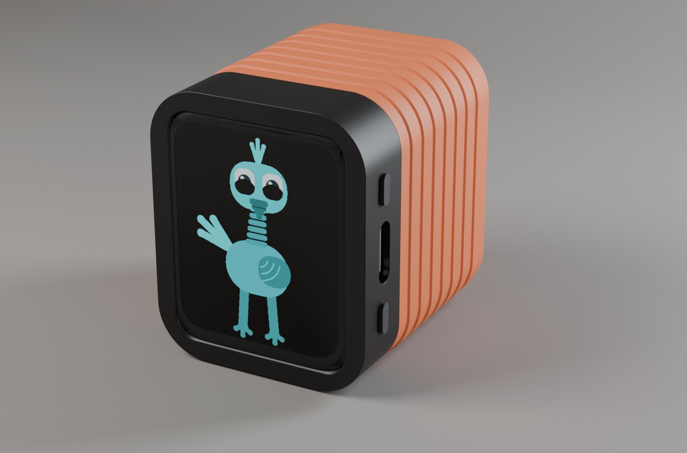
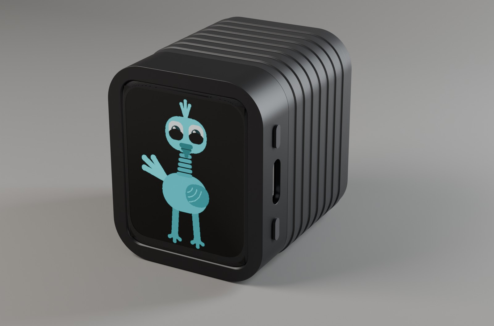
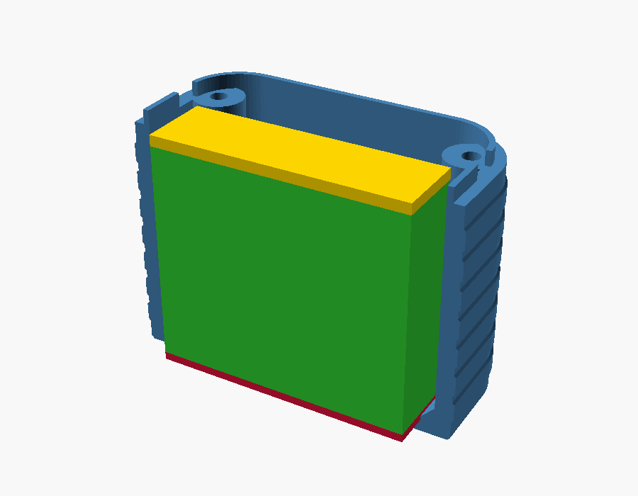
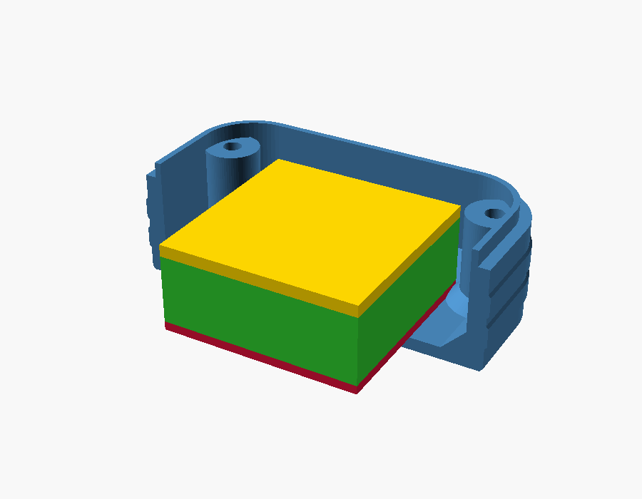
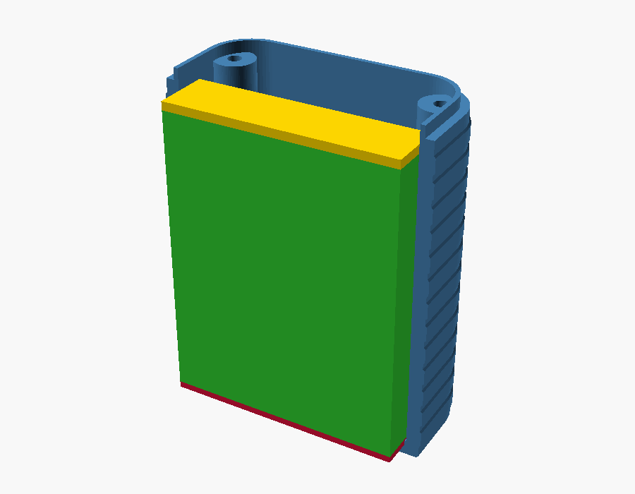
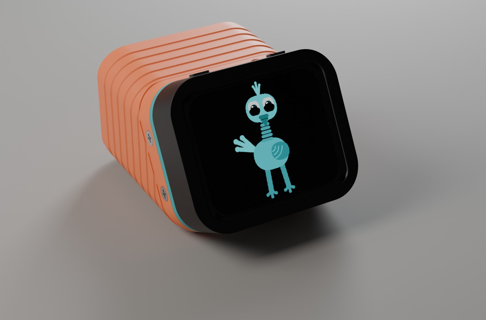
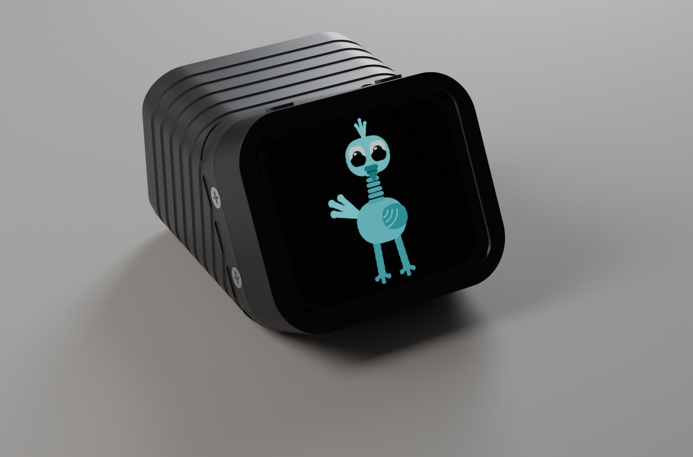
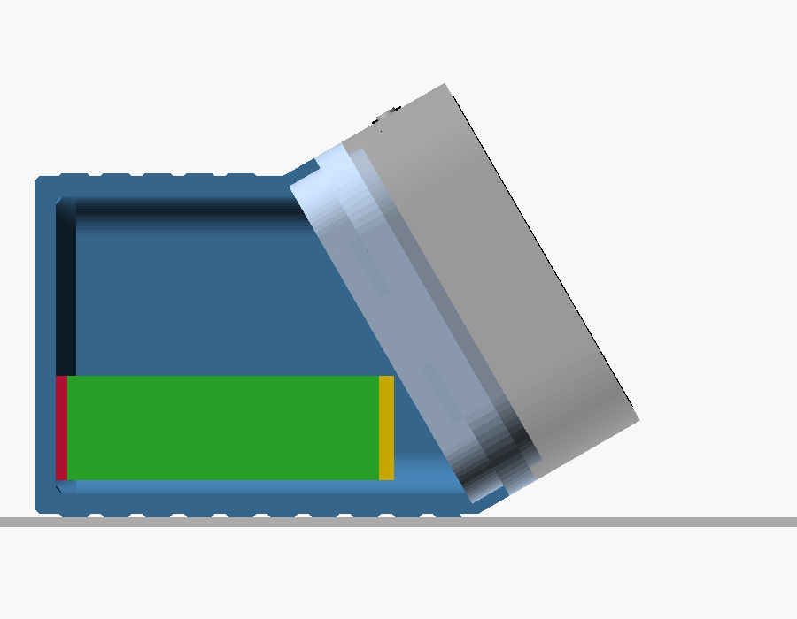
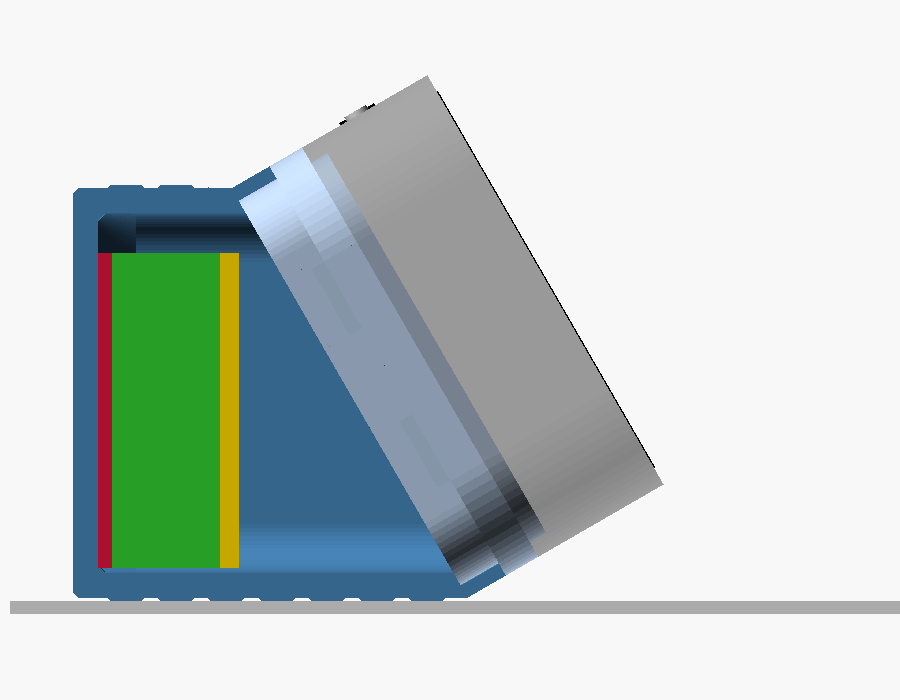
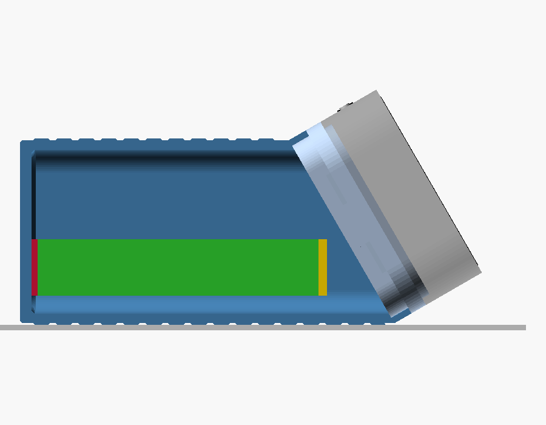

# Deep back plate — ESP32-S3-Touch-AMOLED-1.8

> **Status:** Living · **Last verified:** 2026-10-06

A 3D-printable back cover for the [Waveshare
ESP32-S3-Touch-AMOLED-1.8](https://www.waveshare.com/esp32-s3-touch-amoled-1.8.htm), the little
touchscreen that runs the kids' pet (firmware in
[JBrain2](https://github.com/jeffmhopkins/JBrain2/tree/main/firmware)).
The stock back only fits a tiny battery. This one is a deeper box that holds a real one, screws on
with the original four screw positions, and has grip ribs so small hands don't drop it.

| | |
|---|---|
|  |  |

*Rendered from the model, with Waveshare's 3D model of the board and the firmware's own pet on the
glass, in orange and in black. Print it in any colour.*

## Pick a version

| | [**103035, 1000 mAh**](renders/version-103035.png) (recommended) | [802525, 400 mAh](renders/version-802525.png) | [104050, 2400 mAh](renders/version-104050.png) |
|---|---|---|---|
| |  |  |  |
| Print | `back_plate_103035_1000mAh_edge.stl` | `back_plate_802525_400mAh_flat.stl` | `back_plate_104050_2400mAh_end.stl` |
| Battery sits | on its edge | flat | on its end |
| Finished unit | 37.6 × 45.2 × 44 mm | 37.6 × 45.2 × 24.7 mm | 37.6 × 45.2 × 67 mm |
| Notes | Roomy fit | Thinnest | Tight fit — measure the cell first |

Green is the battery, red the tape under it, yellow the foam on top. Optional:
`amoled18_hole_plugs.stl`, press-in caps that hide the screw openings — **not for babies, they're
a choking hazard**.

## Or: the desk stand

| | |
|---|---|
|  |  |

A two-part version for a desk. A **head** screws to the display in place of the stock cover,
then sinks into the angled end of a plain **battery box**, held by six flush countersunk
screws round its rim. Above the box the head widens into a 3 mm **collar**, flush with the box
and the front shell, so it shows as a band between them: print the head in a different colour
for each unit to tell them apart. The collar's underside is sloped, so it prints without
supports. The box lies on its long flat side, and the screen faces you,
landscape, leaning back 30° from upright, with the USB-C and buttons along its top edge.
The head is the same for every box, so changing battery only means printing another box.

| | [**103035, 1000 mAh**](renders/stand-section-103035.png) (recommended) | [802525, 400 mAh](renders/stand-section-802525.png) | [104050, 2400 mAh](renders/stand-section-104050.png) |
|---|---|---|---|
| |  |  |  |
| Print | `amoled18_stand_head.stl` + `amoled18_stand_box_103035_edge.stl` | head + `amoled18_stand_box_802525_flat.stl` | head + `amoled18_stand_box_104050_end.stl` |
| Box | 46 × 45 × 34 mm | 34 × 45 × 34 mm | 71 × 45 × 34 mm |
| With the display on | 59 × 45 × 42 mm | 47 × 45 × 42 mm | 83 × 45 × 42 mm |
| Notes | Roomy | Shortest | Tight fit — measure the cell first |

Each is cut open as it sits on the table, you on the right: battery green, tape red, foam yellow.
Sizes are front to back × left to right × height. How to print and assemble it:
[PRINTING.md](PRINTING.md#desk-stand).

If you'd rather not have the collar, `amoled18_stand_head_no_collar.stl` is the same head at
the stock cover's height. It needs boxes without the collar's 45° ramp: export them from the
box presets with `collar_h` set to 0 ([MODEL_ADJUSTMENT.md](MODEL_ADJUSTMENT.md#the-head-presets)).

## The guides

| I want to… | Read |
|---|---|
| Print it and put it together | [**PRINTING.md**](PRINTING.md) |
| Change it: another battery, a better fit, different grip | [**MODEL_ADJUSTMENT.md**](MODEL_ADJUSTMENT.md) |
| Fix something that came out wrong | [**TROUBLESHOOTING.md**](TROUBLESHOOTING.md) |
| Understand how it's built and where every number came from | [DESIGN.md](DESIGN.md) |

## Safety

These go to small children. Keep the hole plugs away from babies (glue them in or leave them
off), never squeeze a lithium pouch cell, don't install one that's puffed or damaged, check the
battery plug's polarity before connecting it, and don't leave it charging unattended.

## What's in this repo

| File | What it is |
|---|---|
| `back_plate_*.stl` | Ready-to-print plates, one per version |
| `amoled18_hole_plugs.stl` | Six press-fit plugs |
| `amoled18_stand_head.stl`, `amoled18_stand_box_*.stl` | The desk stand: one head (with its collar), a box per battery |
| `amoled18_stand_head_no_collar.stl` | The same head without the collar (for boxes made with `collar_h` 0) |
| `amoled18_back_plate.scad` | The adjustable model ([MODEL_ADJUSTMENT.md](MODEL_ADJUSTMENT.md)) |
| `amoled18_back_plate.json` | The versions and the desk stand's parts as OpenSCAD presets |
| `renders/` | Every image in these guides, and `make_renders.sh` to regenerate them |
| `photos/` | The real unit |
| `.github/workflows/release.yml` | Cuts a release with every STL attached: Actions tab → Release → Run workflow |
| `reference/` | Archived Waveshare drawings, 3D model, schematic and web pages ([reference/README.md](reference/README.md)) |
| `LICENSE` | CC BY-SA 4.0, below |

## License

The design (the model, STLs, renders, guides and photos) is licensed under
[CC BY-SA 4.0](https://creativecommons.org/licenses/by-sa/4.0/): print it, share it, sell prints,
or remix it, as long as you credit this repo and share remixes under the same license. The
files in `reference/` are Waveshare's, kept unmodified for reference, and are not covered.
